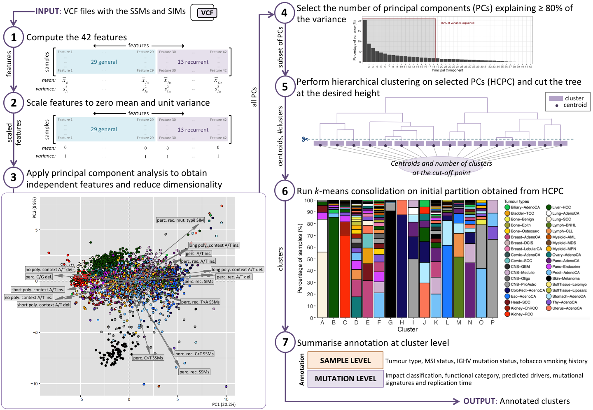

# Recurrent somatic mutations reveal new insights into consequences of mutagenic processes in cancer

<h4>Abstract</h4>

The sheer size of the human genome makes it improbable that identical somatic mutations at the exact same position are observed in multiple tumours solely by chance. The scarcity of cancer driver mutations also precludes positive selection as the sole explanation. Therefore, recurrent mutations may be highly informative of characteristics of mutational processes. To explore the potential, we use recurrence as a starting point to cluster >2,500 whole genomes of a pan-cancer cohort. We describe each genome with 13 recurrence-based and 29 general mutational features. Using principal component analysis we reduce the dimensionality and create independent features. We apply hierarchical clustering to the first 18 principal components followed by k-means clustering. We show that the resulting 16 clusters capture clinically relevant cancer phenotypes. High levels of recurrent substitutions separate the clusters that we link to UV-light exposure and deregulated activity of POLE from the one representing defective mismatch repair, which shows high levels of recurrent insertions/deletions. Recurrence of both mutation types characterizes cancer genomes with somatic hypermutation of immunoglobulin genes and the cluster of genomes exposed to gastric acid. Low levels of recurrence are observed for the cluster where tobacco-smoke exposure induces mutagenesis and the one linked to increased activity of cytidine deaminases. Notably, the majority of substitutions is recurrent in a single tumour type, while recurrent insertions/deletions point to shared processes between tumour types. Recurrence also reveals susceptible sequence motifs, including TT[C>A]TTT and AAC[T>G]T for the POLE and ‘gastric acid-exposure’ clusters, respectively. Moreover, we refine knowledge of mutagenesis, including increased C/G deletion levels in general for lung tumours and specifically in midsize homopolymer sequence contexts for microsatellite instable tumours. Our findings are an important step towards the development of a generic cancer diagnostic test for clinical practice based on whole-genome sequencing that could replace multiple diagnostics currently in use.

 

<h2>Main Figures</h2>

<h4>Fig 1. Recurrence within each tumour type in absolute numbers and percentages</h4>

<strong>DATA:</strong> [TXT table](Recurrence/recurrence_tumortype_ssms_sims.txt)  

 
<h4>Fig 2. Spearman’s rank correlation between the 42 mutational features</h4>

<strong>DATA:</strong> The 42 features used to compute the correlation ([RData](Clustering/Data/samples2features4corr.RData) | [TXT file](Clustering/Data/samples2features4corr.txt)) 

 
<h4>Fig 3. Workflow of the recurrence-based approach to group cancer genomes</h4>

<em>Note</em>: An interactive <strong>3D version of the PCA plot</strong> shown in Step 3 of the workflow is available <a href="https://plot.ly/~biomedicalGenomicsCNAG/1.embed">here</a>.

<strong>DATA:</strong> 

* Output of Step 1: 42 features ([RData](Clustering/Data/step1_sample2features.RData) | [TXT file](Clustering/Data/step1_sample2features.txt)) 
* Output of Step 3 and 4: PCA object ([RData](Clustering/Data/res_pca.RData)) 
* Output of Step 5 and 6: HCPC object ([RData](Clustering/Data/res_hcpc.RData)) and Samples linked to cluster and tumor type ([RData](Clustering/Data/step6_sample2cluster.RData) | [TXT file](Clustering/Data/step6_sample2cluster.txt)) 
* Output of Step 7: Samples annotated with metadata ([RData](Clustering/Data/step7_sample2annotation.RData) | [TXT file](Clustering/Data/step7_sample2annotation.txt)) 

<strong>CODE:</strong> 

 
<h4>Table 1: Key characteristics of the 16 clusters</h4>
 
<strong>DATA:</strong> 

* Piediagram ([RData](Clustering/Data/step6_sample2cluster.RData) | [TXT file](Clustering/Data/step6_sample2cluster.txt))  
* Key characteristics and overall association to recurrence: HCPC object ([RData](Clustering/Data/res_hcpc.RData))

 
<h4>Fig 4. Overview of the 42 features and their association with each cluster</h4>
 

<h4>Fig 5. Enriched sequence motifs</h4> 

<strong>METHOD:</strong> [Description](SequenceContext/Readme.md)  

<strong>DATA:</strong>

<h5>Cluster A (C>A mutations):</h5>

* Nucleotide counts per position in the sequence:  
    * Recurrent mutations ([RData](SequenceContext/Data/Counts/SeqContext_counts_cluster_A_rec_C_A_21positions.RData) | [TXT file](SequenceContext/Data/Counts/SeqContext_counts_cluster_A_rec_C_A_21positions.txt)) 
    * Unique mutations ([RData](SequenceContext/Data/Counts/SeqContext_counts_cluster_A_unique_C_A_21positions.RData) | [TXT file](SequenceContext/Data/Counts/SeqContext_counts_cluster_A_unique_C_A_21positions.txt)) 
* Relative Entropies per nucleotide and Total Entropy per position in the sequence: 
    * Recurrent mutations ([TXT file](SequenceContext/Data/Entropies/SeqContext_RelativeEntropies_and_total_cluster_A_rec_C_A_21positions.txt)) 
    * Unique mutations ([TXT file](SequenceContext/Data/Entropies/SeqContext_RelativeEntropies_and_total_cluster_A_unique_C_A_21positions.txt)) 

<h5>Cluster E (C>G mutations):</h5>

* Nucleotide counts per position in the sequence:  
    * Recurrent mutations ([RData](SequenceContext/Data/Counts/SeqContext_counts_cluster_E_rec_C_G_21positions.RData) | [TXT file](SequenceContext/Data/Counts/SeqContext_counts_cluster_E_rec_C_G_21positions.txt)) 
    * Unique mutations ([RData](SequenceContext/Data/Counts/SeqContext_counts_cluster_E_unique_C_G_21positions.RData) | [TXT file](SequenceContext/Data/Counts/SeqContext_counts_cluster_E_unique_C_G_21positions.txt)) 
* Relative Entropies per nucleotide and Total Entropy per position in the sequence: 
    * Recurrent mutations ([TXT file](SequenceContext/Data/Entropies/SeqContext_RelativeEntropies_and_total_cluster_E_rec_C_G_21positions.txt)) 
    * Unique mutations ([TXT file](SequenceContext/Data/Entropies/SeqContext_RelativeEntropies_and_total_cluster_E_unique_C_G_21positions.txt)) 
    
<h5>Cluster G (C>T mutations):</h5>

* Nucleotide counts per position in the sequence:  
    * Recurrent mutations ([RData](SequenceContext/Data/Counts/SeqContext_counts_cluster_G_rec_C_T_21positions.RData) | [TXT file](SequenceContext/Data/Counts/SeqContext_counts_cluster_G_rec_C_T_21positions.txt)) 
    * Unique mutations ([RData](SequenceContext/Data/Counts/SeqContext_counts_cluster_G_unique_C_T_21positions.RData) | [TXT file](SequenceContext/Data/Counts/SeqContext_counts_cluster_G_unique_C_T_21positions.txt)) 
* Relative Entropies per nucleotide and Total Entropy per position in the sequence: 
    * Recurrent mutations ([TXT file](SequenceContext/Data/Entropies/SeqContext_RelativeEntropies_and_total_cluster_G_rec_C_T_21positions.txt)) 
    * Unique mutations ([TXT file](SequenceContext/Data/Entropies/SeqContext_RelativeEntropies_and_total_cluster_G_unique_C_T_21positions.txt))     

<h5>Cluster H (C>A mutations):</h5>

* Nucleotide counts per position in the sequence:  
    * Recurrent mutations ([RData](SequenceContext/Data/Counts/SeqContext_counts_cluster_H_rec_C_A_21positions.RData) | [TXT file](SequenceContext/Data/Counts/SeqContext_counts_cluster_H_rec_C_A_21positions.txt)) 
    * Unique mutations ([RData](SequenceContext/Data/Counts/SeqContext_counts_cluster_H_unique_C_A_21positions.RData) | [TXT file](SequenceContext/Data/Counts/SeqContext_counts_cluster_H_unique_C_A_21positions.txt)) 
* Relative Entropies per nucleotide and Total Entropy per position in the sequence: 
    * Recurrent mutations ([TXT file](SequenceContext/Data/Entropies/SeqContext_RelativeEntropies_and_total_cluster_H_rec_C_A_21positions.txt)) 
    * Unique mutations ([TXT file](SequenceContext/Data/Entropies/SeqContext_RelativeEntropies_and_total_cluster_H_unique_C_A_21positions.txt)) 

<h5>Cluster L (T>G mutations):</h5>

* Nucleotide counts per position in the sequence:  
    * Recurrent mutations ([RData](SequenceContext/Data/Counts/SeqContext_counts_cluster_L_rec_T_G_21positions.RData) | [TXT file](SequenceContext/Data/Counts/SeqContext_counts_cluster_L_rec_T_G_21positions.txt)) 
    * Unique mutations ([RData](SequenceContext/Data/Counts/SeqContext_counts_cluster_L_unique_T_G_21positions.RData) | [TXT file](SequenceContext/Data/Counts/SeqContext_counts_cluster_L_unique_T_G_21positions.txt)) 
* Relative Entropies per nucleotide and Total Entropy per position in the sequence: 
    * Recurrent mutations ([TXT file](SequenceContext/Data/Entropies/SeqContext_RelativeEntropies_and_total_cluster_L_rec_T_G_21positions.txt)) 
    * Unique mutations ([TXT file](SequenceContext/Data/Entropies/SeqContext_RelativeEntropies_and_total_cluster_L_unique_T_G_21positions.txt)) 

<strong>CODE:</strong> [SequenceLogos_script](SequenceContext/Code/SequenceLogos_script.R)  

 
<h4>Fig 6. Factors impacting on recurrence in the context of the clusters</h4> 

 
<h2>Supporting Information</h2>

<h4>S1 Figure. Clustering tree showing tumour type distribution for 2 to 20 clusters.</h4>

<strong>DATA:</strong> [Clustering Tree (TXT table)](Clustering/Data/HierarchClust20_sample2clust.txt)  
*Table providing the distribution of samples at different cluster resolutions (from 2 to 20 clusters)*

 
<h4>S2 Figure. Enriched sequence motifs for C>G SSMs in cluster M.</h4>

<strong>METHOD:</strong> [Description](SequenceContext/Readme.md)  

<strong>DATA:</strong>

<h5>Cluster M (C>G mutations):</h5>

* Nucleotide counts per position in the sequence:  
    * Recurrent mutations ([RData](SequenceContext/Data/Counts/SeqContext_counts_cluster_M_rec_C_G_21positions.RData) | [TXT file](SequenceContext/Data/Counts/SeqContext_counts_cluster_M_rec_C_G_21positions.txt)) 
    * Unique mutations ([RData](SequenceContext/Data/Counts/SeqContext_counts_cluster_M_unique_C_G_21positions.RData) | [TXT file](SequenceContext/Data/Counts/SeqContext_counts_cluster_M_unique_C_G_21positions.txt)) 
* Relative Entropies per nucleotide and Total Entropy per position in the sequence: 
    * Recurrent mutations ([TXT file](SequenceContext/Data/Entropies/SeqContext_RelativeEntropies_and_total_cluster_M_rec_C_G_21positions.txt)) 
    * Unique mutations ([TXT file](SequenceContext/Data/Entropies/SeqContext_RelativeEntropies_and_total_cluster_M_unique_C_G_21positions.txt)) 

<strong>CODE:</strong> [SequenceLogos_script](SequenceContext/Code/SequenceLogos_script.R) 

 

<h4>S3 Figure. Enriched sequence motifs for T>G SSMs in cluster H.</h4>

<strong>METHOD:</strong> [Description](SequenceContext/Readme.md)  

<strong>DATA:</strong>

<h5>Cluster H (T>G mutations):</h5>

* Nucleotide counts per position in the sequence:  
    * Recurrent mutations ([RData](SequenceContext/Data/Counts/SeqContext_counts_cluster_H_rec_T_G_21positions.RData) | [TXT file](SequenceContext/Data/Counts/SeqContext_counts_cluster_H_rec_T_G_21positions.txt)) 
    * Unique mutations ([RData](SequenceContext/Data/Counts/SeqContext_counts_cluster_H_unique_T_G_21positions.RData) | [TXT file](SequenceContext/Data/Counts/SeqContext_counts_cluster_H_unique_T_G_21positions.txt)) 
* Relative Entropies per nucleotide and Total Entropy per position in the sequence: 
    * Recurrent mutations ([TXT file](SequenceContext/Data/Entropies/SeqContext_RelativeEntropies_and_total_cluster_H_rec_T_G_21positions.txt)) 
    * Unique mutations ([TXT file](SequenceContext/Data/Entropies/SeqContext_RelativeEntropies_and_total_cluster_H_unique_T_G_21positions.txt)) 

<strong>CODE:</strong> [SequenceLogos_script](SequenceContext/Code/SequenceLogos_script.R)  

---

<h4>S1 Table. Tumour type abbreviation, full name and number of samples.</h4>

<h4>S2 Table. Recurrence in pan-cancer context and within tumour type(s).</h4>

---

<h4>S1 Text. Estimation of the levels of recurrence when purely driven by chance.</h4>

<strong>METHOD:</strong> [Description](Simulations/README.md)  

<strong>DATA:</strong> 

* Summary tables of 5000 simulations:  
    * Recurrence pan-cancer per tumour type ([RData](Simulations/Data/recurrence_tumortype_pancancer_5000simul.RData) | [TXT file](Simulations/Data/recurrence_tumortype_pancancer_5000simul.txt)) 
    * Recurrence within tumour type ([RData](Simulations/Data/recurrence_tumortype_within_5000simul.RData) | [TXT file](Simulations/Data/recurrence_tumortype_within_5000simul.txt)) 
    * Recurrence per substitution type ([RData](Simulations/Data/recurrence_subtype_5000simul.RData) | [TXT file](Simulations/Data/recurrence_subtype_5000simul.txt)) 
    * Overall recurrence ([RData](Simulations/Data/recurrence_overall_5000simul.RData) | [TXT file](Simulations/Data/recurrence_overall_5000simul.txt)) 

<strong>CODE:</strong> 

* [Performance of simulations](Simulations/Code/sim-all-cancers.R)  
* [Summarise per tumour type](Simulations/Code/summarise.R) 
* [Summarise per substitution type](Simulations/Code/summarise-mut-type.R) 
* [Boxplot representation](Simulations/Code/representation-simulations.R) 

 
<h4>S2 Text. Recurrence versus general mutational characteristics.</h4>
 
<h4>S3 Text. Detailed cluster-specific descriptions.</h4>
 
<h4>S4 Text. Smoking history and related mutational subtypes.</h4>

---

<h4>S1 File. Characteristic plots summarising each of the 42 features.</h4>

<h4>S2 File. Sample distribution per tumour type across the 16 clusters.</h4>
